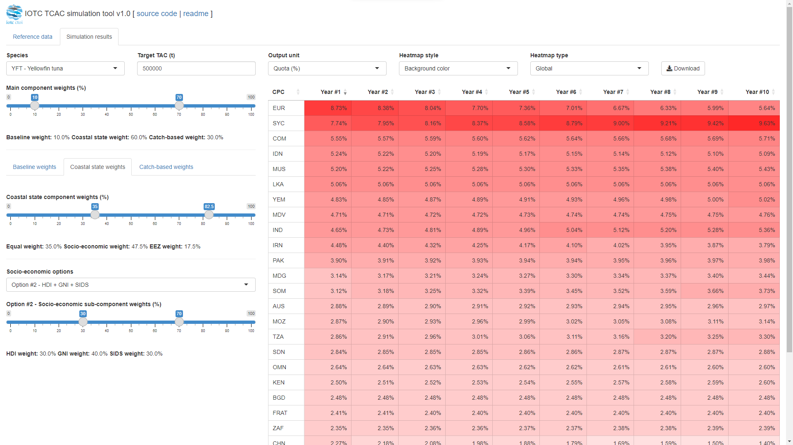
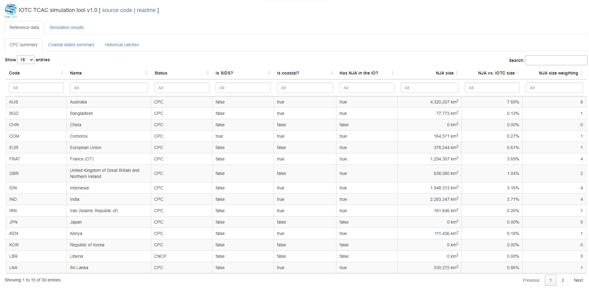
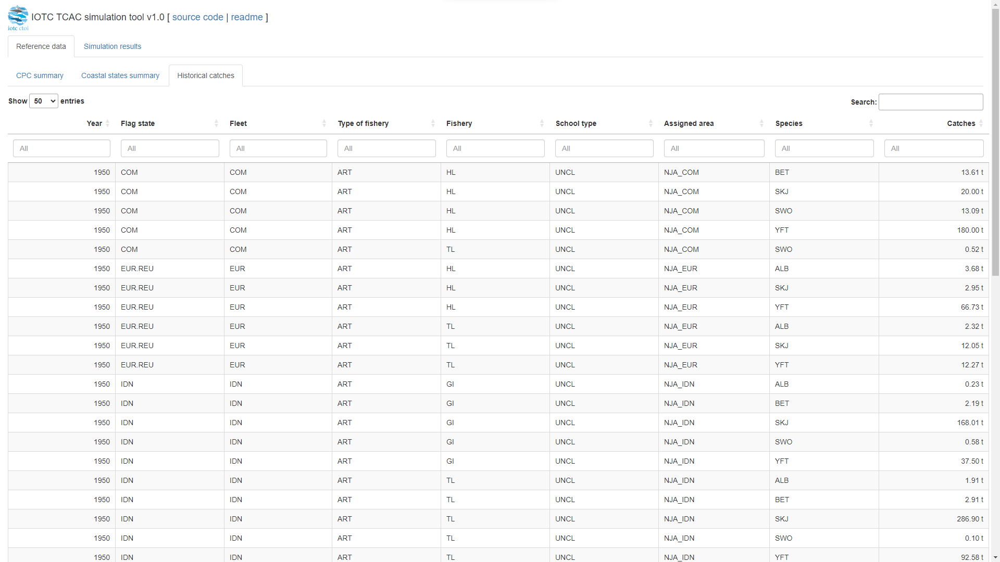
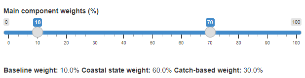
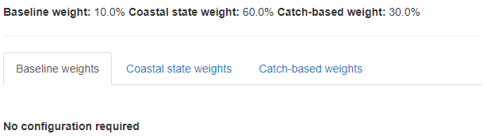
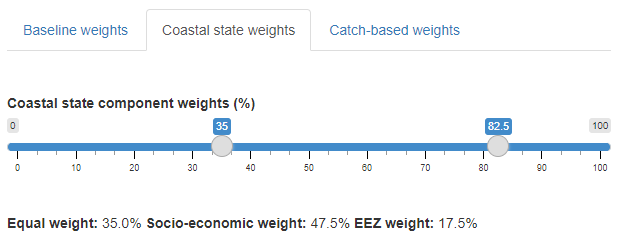
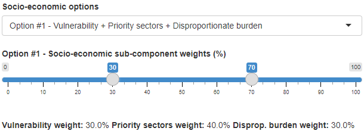
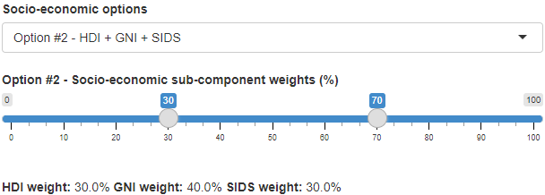
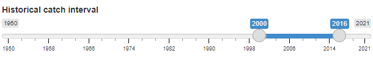
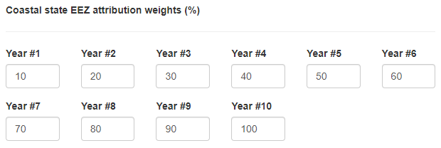

# Purpose of this document

This document provides an overview of the [preliminary assumptions](#assumptions) and final outputs produced by the simulation of the allocation criteria in [IOTC-2024-TCAC13-REF02](https://iotc.org/sites/default/files/documents/2023/11/IOTC-2024-TCAC13-REF02E_TCAC_draft_Allocation_Regime_v7_clean.docx) as developed by the [IOTC Secretariat](mailto:IOTC-Secretariat@fao.org).

It also describes the [*user interface*](#ui) of the simulation tool, with additional details on the various configuration parameters for both the [simulation process](#inputConfig) and the [produced outputs](#outputs).

# Process configuration

The definition of all relevant parameters characterising each CPC with respect to the allocation criteria is provided in the [`cfg/CPC_CONFIGURATIONS.xlsx`](./CPC_CONFIGURATIONS.xlsx) file.

This includes two worksheets:

-   `CPC` - listing all current IOTC *Contracting Parties* (CP) and *Cooperating Non-Contracting Parties* (CNCP) together with their:

    -   mnemonic code (generally, the ISO3 code of the country)
    -   official English name (as an IOTC CPC)
    -   CP / CNCP status
    -   *small islands developing state* (SIDS) status
    -   *coastal state* status
    -   presence of a *national jurisdiction area* (NJA) within the [IOTC area of competence](https://iotc.org/about-iotc/competence)
    -   size of the NJA (in km2, calculated from the shapefiles available to the IOTC Secretariat and originally downloaded from the VLIZ / Marine Regions [*maritime boundaries* database](https://www.marineregions.org/eezsearch.php))
    -   relative size of the NJA with respect to the IOTC area of competence.  

-   `COASTAL_STATE_SOCIO_ECONOMIC` - listing all IOTC CPCs that are either a coastal state or have a NJA within the Indian Ocean, together with their development status (retrieved from [here](https://www.un.org/development/desa/dpad/wp-content/uploads/sites/45/WESP2020_Annex.pdf)), and a set of socio-economic indicators to address the requirements of both *Option 1* and *Option 2* in [IOTC-2024-TCAC13-REF02](https://iotc.org/sites/default/files/documents/2023/11/IOTC-2024-TCAC13-REF02E_TCAC_draft_Allocation_Regime_v7_clean.docx) para. 6.6(1)(b).

    -   The indicators required by *Option 1*:

        -   per capita fish consumption (kg / person / year)

        -   *Commonwealth Universal Vulnerability index* (CUVI)

        -   contribution (%) of fish workers employed in small-scale and artisanal fisheries

        -   contribution (%) of fisheries to GDP

        -   contribution (%) of fisheries exports to total export value

        **are not yet available to the IOTC Secretariat** and have therefore been replaced by **dummy values**.

        > For this reason, the results produced by the simulation through *Option 1* **should NOT be considered *official* by any means** until the original proponents provide the IOTC Secretariat with all required values of those socio-economic indicators.

    -   The HDI (2021) and GNI indicators required by *Option 2* have been retrieved from the [UNDP](https://hdr.undp.org/data-center/human-development-index#/indicies/HDI) and [WorldBank](https://datahelpdesk.worldbank.org/knowledgebase/articles/906519-world-bank-country-and-lending-group) websites, respectively, with the HDI index for the EU averaged from [here](https://www.theglobaleconomy.com/rankings/human_development/European-union/).

## Assumptions {#assumptions}

### CPC and coastal state configuration

The identification of a CPC as *being* or *not being* an IOTC coastal state is still a matter of debate for some IOTC members that have NJAs within the IOTC area of competence.

For the sake of this simulation, it was assumed that:

-   the attribution of a NJA in the Indian Ocean to a given CPC reflects the information available to the IOTC as of 31/12/2023

-   beside having an NJA in the Indian Ocean, `FRAT` (*France (OT)*) shall be *de facto* considered as an IOTC coastal state (see Appendix 4, para. 2 of [https://iotc.org/documents/TCAC/12/RE](https://iotc.org/sites/default/files/documents/2023/12/IOTC-2023-TCAC12-RE.pdf) *Report of the 12^th^ Technical Committee on Allocation Criteria*).

-   `EUR` (*European Union / REIO*) has an NJA in the Indian Ocean (i.e., the NJA around Réunion and Mayotte) and that for this reason "(...) *should benefit from an allocation that relates to the size of the EEZ of its outermost territories in the IOTC area of competence.*" (see Appendix 4, para. 2 of [https://iotc.org/documents/TCAC/12/RE](https://iotc.org/sites/default/files/documents/2023/12/IOTC-2023-TCAC12-RE.pdf) *Report of the 12^th^ Technical Committee on Allocation Criteria*).

-   `EUR`, notwithstanding the above, "(...) *would not be seeking the application of paragraph 6.6(1)(b) of the coastal state allocation criteria (...)*" (see Appendix 4, para. 2 of [https://iotc.org/documents/TCAC/12/RE](https://iotc.org/sites/default/files/documents/2023/12/IOTC-2023-TCAC12-RE.pdf) *Report of the 12^th^ Technical Committee on Allocation Criteria*).

-   there are different views as whether `EUR` "(...) *should benefit from the portion of the coastal state allocation criteria related to aspirations under paragraph 6.6(1)(a) (...)*" (see Appendix 4, para. 2 of [https://iotc.org/documents/TCAC/12/RE](https://iotc.org/sites/default/files/documents/2023/12/IOTC-2023-TCAC12-RE.pdf) *Report of the 12^th^ Technical Committee on Allocation Criteria*).

> For simplicity's sake, the simulation temporarily considered `EUR` as benefiting from the portion of allocation specified by paragraph 6.6(1)(a) of [IOTC-2024-TCAC13-REF02](https://iotc.org/sites/default/files/documents/2023/11/IOTC-2024-TCAC13-REF02E_TCAC_draft_Allocation_Regime_v7_clean.docx).

-   subsequent to TCAC12, in consultations between the IOTC Secretariat and `GBR` (*United Kingdom of Great Britain and Northern Ireland*), `GBR` has noted to the Secretariat that para 6.6.(1)(b) would not apply to their case, but that 6.6.(1)(a) and (c) would, and this has been reflected in the current configuration of the TCAC simulations made by the Secretariat.

### Historical catches

This information is required to calculate the third component (*catch-based*) of the allocation criteria and can be downloaded from: [`cfg/HISTORICAL_CATCH_ESTIMATES.csv`](./HISTORICAL_CATCH_ESTIMATES.csv).

Historical catches are available for all years from 1950 to 2021 stratified by year, fleet, gear, school type, species, and assigned area.

It has to be noted how the need of apportioning historical catches by flag or fleet according to the area of operation (high seas vs. the NJA of any given coastal state) requires the IOTC Secretariat to estimate this information through a process that has been presented at the last TCAC meeting in October 2023, and agreed by the meeting participants.

For this reason, the historical catch series with full area breakdown is only available for the five major IOTC species (albacore, bigeye, skipjack, swordfish, and yellowfin tuna) and has been estimated using the regular grid vs. NJA overlapping area fraction as a way of assigning catches estimated for the former to the area that falls within a given NJA.

> At this stage of the process, there is no additional information from CPCs that might confirm whether their catches in a given grid shall only be attribute to the flag state or not. For this reason, the simulation uses the information in the `ASSIGNED_AREA` column of the historical catch series to calculate the anual catches for a given coastal state / flag state (when required).

For the sake of calculating the catch-based allocation weight for each CPC, information on historical catches is averaged across a selectable timeframe with two possible approaches that require to compute:

-   the annual average across the entire time period
-   the average of the best "*n*" years across the time period

In the latter case, the *best years* are considered to be those with the highest catches across the selected period (for a given fleet / species).

# User interface {#ui}

The simulation is presented through an interactive R-Shiny [web application](https://data.iotc.org/tcac13/simulations/) which is currently password-protected and whose access credentials will be provided to participating delegates.

The main screen presents two tabbed panels, one to display the [reference data](#referenceData) used by the simulation, and [one](#simulationResults) to present users with all [configuration parameters](#inputConfig) and the [simulation outputs](#outputs).

{style="padding-bottom: 1em;"}

 

## *Reference data* panel {#referenceData}

This panel provides access to three main categories of configuration datasets:

-   ***CPC summary***, with the basic details for each IOTC CPC and CNCP and information on the NJA they might have in the IOTC area of competence

    

     

-   ***Coastal states summary***, with details of all IOTC CPCs that are either explicitly considered as coastal states, or that have a NJA within the IOTC area of competence. These include two distinct sets of socio-economic indicators to be used in agreement with the simulation requirements

    

     

-   ***Historical catches***, with estimated catches for the five major IOTC species stratified by year, flag, fleet, type of fishery, type of school association, assigned area, and species

    {style="padding-bottom: 1em;"}

     

> All three datasets are presented as sortable, filterable tables and provide an interactive version of the configuration files included with the application.

## *Simulation results* panel {#simulationResults}

This panel provides access to the [configuration parameters](#inputConfig) and to the [simulation outputs](#outputs) projected up to 10 years in the future to take into account the transitional period in the allocation of catches from flag states to coastal states, when necessary.

### *Configuration parameters* {#inputConfig}

-   The ***Species*** subject to the simulation (affects the catch records to be used to calculate the *catch-based* allocation component)

-   The ***Target TAC*** in tons (affects the estimated annual catches for each CPC and year)

    {style="border: 1px solid black;"}

     

-   The ***Main component weights***, i.e.:

    {style="border: 1px solid black;"}

     

    1.  The ***Baseline weight***, that doesn't require any further configuration as it assign an equal portion of the quota to each CPC (see [IOTC-2024-TCAC13-REF02](https://iotc.org/sites/default/files/documents/2023/11/IOTC-2024-TCAC13-REF02E_TCAC_draft_Allocation_Regime_v7_clean.docx) para. 6.5)

        {style="border: 1px solid black;"}

         

    2.  The ***Coastal state weight***, that applies to all IOTC CPCs with a NJA in the IOTC area of competence (see [IOTC-2024-TCAC13-REF02](https://iotc.org/sites/default/files/documents/2023/11/IOTC-2024-TCAC13-REF02E_TCAC_draft_Allocation_Regime_v7_clean.docx) para. 6.6 (1)

        {style="border: 1px solid black;"}

         

        This component weight is further broken down into:

        1.  ***Equal weight*** (see [IOTC-2024-TCAC13-REF02](https://iotc.org/sites/default/files/documents/2023/11/IOTC-2024-TCAC13-REF02E_TCAC_draft_Allocation_Regime_v7_clean.docx) para. 6.6(1)(a))

        2.  ***Socio-economic weight*** (see [IOTC-2024-TCAC13-REF02](https://iotc.org/sites/default/files/documents/2023/11/IOTC-2024-TCAC13-REF02E_TCAC_draft_Allocation_Regime_v7_clean.docx) para. 6.6(1)(b))

            Its sub-components are selectable among two possible options that take in consideration different aspects of the social and economic environment and status of all IOTC CPCs:

            -   **Option #1**: *vulnerability + priority sectors + disproportionate burden* (see [IOTC-2024-TCAC13-REF02](https://iotc.org/sites/default/files/documents/2023/11/IOTC-2024-TCAC13-REF02E_TCAC_draft_Allocation_Regime_v7_clean.docx) para. 6.6(1)(a)[OPTION 1])

                 

                {style="border: 1px solid black;"}

                 

                This option includes three distinct sub-component weights to account for:

                1.  the **vulnerability** of the CPC (see [IOTC-2024-TCAC13-REF02](https://iotc.org/sites/default/files/documents/2023/11/IOTC-2024-TCAC13-REF02E_TCAC_draft_Allocation_Regime_v7_clean.docx) para. 6.6(1)(a)[OPTION 1 (i)], whose main components (equally weighted at 50% each) are:
                    -   the **per capita fish consumption**
                    -   the **Commonwealth Universal Vulnerability index** (CUVI)
                2.  the **priority sectors** of the CPC (see [IOTC-2024-TCAC13-REF02](#0) para. 6.6(1)(a)[OPTION 1 (ii)], whose main components (equally weighted at 50% each) are:
                    -   the **proportion of fish workers employed in small-scale and artisanal fisheries**
                    -   the **SIDS** status (yes / no)
                3.  the **disproportionate burden** on developing CPCs (see [IOTC-2024-TCAC13-REF02](#0) para. 6.6(1)(a)[OPTION 1 (iii)], whose main components (equally weighted at 50% each) are:
                    -   the **contribution of the whole fisheries sector to the GDP**
                    -   the **proportion of total export value made up of fisheries export**

                 

            -   **Option #2**: *HDI + GNI + SIDS* (see [IOTC-2024-TCAC13-REF02](https://iotc.org/sites/default/files/documents/2023/11/IOTC-2024-TCAC13-REF02E_TCAC_draft_Allocation_Regime_v7_clean.docx) para. 6.6(1)(a)[OPTION 2])

                 

                {style="border: 1px solid black;"}

                 

                This option includes three distinct sub-component weights to account for:

                1.  The **Human Development Index** (HDI) status

                2.  The **Gross National Income** (GNI) status

                3.  The **Small Island Developing State** (SIDS) status

        3.  ***EEZ weight*** (see [IOTC-2024-TCAC13-REF02](https://iotc.org/sites/default/files/documents/2023/11/IOTC-2024-TCAC13-REF02E_TCAC_draft_Allocation_Regime_v7_clean.docx) para. 6.6(1)(c)) to replace the lack of indicators based on spatial stock abundance.

            > In this case, the size of the national jurisdiction area of a CPC within the IOTC area of competence is weighted according to its relative size compared to the latter.

    3.  The ***Catch-based weight***, to reflect the requirement that CPCs shall be eligible to receive such allocation based on the historical catches of the CPC **for each stock**. The criteria with which the historical catches are considered to determine this weight are indicated in [IOTC-2024-TCAC13-REF02](https://iotc.org/sites/default/files/documents/2023/11/IOTC-2024-TCAC13-REF02E_TCAC_draft_Allocation_Regime_v7_clean.docx) para. 8, and the simulation tools allows to choose and configure:

        1.  The ***Historical catch interval***, which affects the determination of the average catches (see [IOTC-2024-TCAC13-REF02](https://iotc.org/sites/default/files/documents/2023/11/IOTC-2024-TCAC13-REF02E_TCAC_draft_Allocation_Regime_v7_clean.docx) para. 6.8(1)(a))

            {style="border: 1px solid black;"}

             

        2.  The type of ***Historical catch average*** to be considered (see [IOTC-2024-TCAC13-REF02](https://iotc.org/sites/default/files/documents/2023/11/IOTC-2024-TCAC13-REF02E_TCAC_draft_Allocation_Regime_v7_clean.docx) para. 6.8(1)(a)), which shall be one among:

            -   **Selected period** to calculate the average catch by CPC across the entire historical catch interval

                {style="border: 1px solid black;"}

                 

            -   **Best "n" years** to calculate the average catch by CPC over the best 'n' years (in terms of catches) identified within the historical catch interval, with ***Number of years*** as a selectable parameter

                {style="border: 1px solid black;"}

                 

        3.  A stepwise approach (see [IOTC-2024-TCAC13-REF02](https://iotc.org/sites/default/files/documents/2023/11/IOTC-2024-TCAC13-REF02E_TCAC_draft_Allocation_Regime_v7_clean.docx) para. 6.12) to implement the NJA attribution to coastal / flag states as per [IOTC-2024-TCAC13-REF02](https://iotc.org/sites/default/files/documents/2023/11/IOTC-2024-TCAC13-REF02E_TCAC_draft_Allocation_Regime_v7_clean.docx) para. 6.8(2) over the course of 6 or 10 years, which is presented as a species-independent set of 10 coefficients that determine the fraction of catches from a flag state that are estimated to have been taken into the NJA of a CPC, and that shall be therefore assigned to the coastal state owning the NJA

            {style="border: 1px solid black;"}

             

            > Each coefficient represent the percentage of said catches that shall be attributed for that year to the coastal state. In theory, these coefficients shall represent a progression from a starting value \< 100% to 100% (all catches are attributed to the coastal state) but nothing prevents users to introduce whatever sequence they want for these coefficients.

### *Outputs* {#outputs}

The outputs of the simulation are presented as a table that has CPCs as rows and allocation years as columns (from 1 to indicate the initial year, up to a maximum of 10).

Each cell contains the quota assigned to the CPC for a specific year and depending on the choice of the ***Output unit*** parameter it can be expressed either as a fraction (% of the TAC for a given species) or as an absolute value in tons, which is computed from the output quotas (in %) and the TAC (in tons) set by the user.

Each cell has by default a background color whose intensity is directly proportional to the value within the cell, as compared to other cells / values within the same year or globally across the entire table.

The visual representation of the relative cell value can be changed via the ***Heatmap style*** parameter.

This presents two possible options:

-   **Background colour** (default) to represent the (relative) cell value through the intensity of the background

    {style="padding-bottom: 1em;"}

     

-   **Bar** to represent the (relative) cell value through a horizontal bar

    {style="padding-bottom: 1em;"}

     

The context in which the relative cell value is calculated can also be changed via the ***Heatmap type*** parameter.

This presents two possible options:

-   **Global** (default), to calculate each cell's relative value with respect to all values in the table, or

-   **By year** to calculate each cell's relative value with respect to all values estimated for the same year

Finally, the simulation results can be downloaded as an Excel file through the ***Download*** button. The name of the file corresponds to the serialized date (including the time) at which the download request was issued (e.g., `TCAC13_simulation_2024_02_01_150856.xlsx`), while its content includes the following five worksheets:

1.  `CPC_REFERENCES` containing the CPC configuration parameters as in [`cfg/CPC_CONFIGURATIONS.xlsx`](./CPC_CONFIGURATIONS.xlsx)

2.  `COASTAL_STATE_REFERENCES` containing the coastal states configuration parameters as in [`cfg/CPC_CONFIGURATIONS.xlsx`](./CPC_CONFIGURATIONS.xlsx)

3.  `HISTORICAL_CATCHES` containing the historical catches for the selected species as extracted from [`cfg/HISTORICAL_CATCH_ESTIMATES.csv`](./HISTORICAL_CATCH_ESTIMATES.csv)

4.  `SIMULATION_CONFIGURATION` containing all the configuration parameters set by the users for the specific simulation round

5.  `OUTPUT_QUOTAS` containing the outputs of the simulation expressed either as fraction of the annual TAC or as catches in tons by CPC and simulation year (depending on the chosen value of the **output unit** parameter)
