# Overview

This repository hosts a Shiny App developed by the IOTC Secretariat to simulate and explore how different allocation scenarios affect the distribution of total catch among IOTC Contracting Parties and Cooperating non-contracting Parties (CPCs). The tool allows users to adjust parameters reflecting various allocation criteria, including each CPC's status -- i.e.,  Developing Coastal State, Least Developed Country, and Small Island Developing State --, historical catch levels, and catches taken within National Jurisdiction Areas (NJAs) by foreign fleets. It is designed to support transparent discussions and informed decision-making under the framework of the Technical Committee on Allocation Criteria (TCAC).

# Input Data

### Entity Reference Table

The definitions of all parameters used to characterise each CPC in relation to the allocation criteria are provided in the [`inputs/data/iotc_entities.csv`](./inputs/data/iotc_entities.csv) file. This file lists all current IOTC *Contracting Parties* (CP) and *Cooperating Non-Contracting Parties* (CNCP), as well as Taiwan,China as a *Fishing Entity* (FE), together with the following information:

| Field name        | Description | Source |
| :------ | :--------------------- | :-------- |
| `ISO3_CODE`       | Three-letter ISO 3166-1 alpha-3 country code | [IOTC (2026)](https://data.iotc.org/reference/latest/domain/admin/#Entities) | 
| `M49_CODE`        | United Nations M49 numeric country or area code, used for statistical purposes | [UN (2026) ](https://unstats.un.org/unsd/methodology/m49/) |
| `NAME_EN`         | Official name of the Contracting Party, Cooperating Non-Contracting Party, or Fishing Entity in English | [IOTC (2026)](https://data.iotc.org/reference/latest/domain/admin/#Entities) |
| `NAME_FR`         | Official name of the Contracting Party, Cooperating Non-Contracting Party, or Fishing Entity in French | [IOTC (2026)](https://data.iotc.org/reference/latest/domain/admin/#Entities) |
| `STATUS_CODE`     | IOTC membership status code: `CP` (Contracting Party), `CNCP` (Cooperating Non-Contracting Party), or `FE` (Fishing Entity) | [IOTC (2026)](https://data.iotc.org/reference/latest/domain/admin/#CPCs) |
| `STATUS`          | Descriptive label corresponding to `STATUS_CODE` (e.g. *Contracting Party*, *Cooperating Non-Contracting Party*, *Fishing Entity*) | [IOTC (2026)](https://data.iotc.org/reference/latest/domain/admin/#CPCs) |
| `IS_DEVELOPING`   | Indicator of developing country status according to [United Nations classification (`TRUE` / `FALSE`) | [UN (2020)](https://www.un.org/development/desa/dpad/wp-content/uploads/sites/45/WESP2020_Annex.pdf) |
| `IS_LDC`          | Indicator of Least Developed Country (LDC) status according to United Nations classification (`TRUE` / `FALSE`) | [UN (2026)](https://unstats.un.org/unsd/methodology/m49/#ldc) |
| `IS_SIDS`         | Indicator of Small Island Developing State (SIDS) status according to United Nations classification (`TRUE` / `FALSE`) | [UN (2026)](https://unstats.un.org/unsd/methodology/m49/#sids) |
| `IS_COASTAL`      | Indicator of coastal State status within the IOTC Area of Competence (`TRUE` / `FALSE`) | [Flanders Marine Institute (2026)](https://www.marineregions.org/) |
| `NJA_IO_SIZE`     | Surface area (in square kilometres) of the national jurisdictional area (Exclusive Economic Zone and/or equivalent maritime zones) within the Indian Ocean | [Flanders Marine Institute (2026)](https://www.marineregions.org/) |

### Historical Catches

This information is essential for calculating the third component (*catch-based*) of the allocation criteria and can be downloaded from [`cfg/HISTORICAL_CATCH_ESTIMATES.csv`](./HISTORICAL_CATCH_ESTIMATES.csv). The file can be opened as a spreadsheet using MS Excel, LibreOffice Calc, Google Sheets, or any text editor.

The catch input file used by the TCAC application contains aggregated catch estimates by year, flag, fleet, fishery, area, and species. The definitions of the fields included in this file are provided below.

| Field name           | Description |
|:------- | :-------------------------- |
| `YEAR`               | Year of fishing activity |
| `FLAG_CODE`          | Code identifying the [flag State](https://data.iotc.org/reference/latest/domain/admin/#countries)e, as defined in the IOTC reference list of countries |
| `FLEET_CODE`         | Code identifying the [fishing fleet](https://data.iotc.org/reference/latest/domain/admin/#fleets), as defined in the IOTC reference list of fleets |
| `FISHERY_TYPE`       | Code identifying the main fishery category: `ART` (Artisanal) or `IND` (Industrial) |
| `FISHERY_CODE`       | Code identifying the [fishing gear](https://data.iotc.org/reference/latest/domain/fisheries/#Gears) used, as defined in the IOTC reference list of fishing gears |
| `SCHOOL_TYPE_CODE`   | Code identifying the type of tuna school association: `LS` (school associated with a drifting floating object, natural or artificial) or `FS` (free-swimming school) |
| `ASSIGNED_AREA`      | Area where the catch is assigned. Values include Areas Beyond National Jurisdiction (`HIGH_SEAS`) and National Jurisdiction Areas (`NJA_xxx`), where the last three characters correspond to the relevant [country code](https://data.iotc.org/reference/latest/domain/admin/#countries), e.g. `NJA_COM` for the National Jurisdiction Area of Comoros |
| `SPECIES_CODE`       | Code identifying the [species](https://data.iotc.org/reference/latest/domain/biology/#IOTCspecies) : `ALB` (albacore), `BET` (bigeye tuna), `SKJ` (skipjack tuna), `SWO` (swordfish), `YFT` (yellowfin tuna) |
| `CATCH_MT`           | Estimated catch, expressed in metric tonnes |

Historical catch data are available for all years from 1950 to 2021 stratified by year, fleet, gear, school type, species, and assigned area.

It is important to note that the need to apportion historical catches by flag or fleet according to the area of operation (high seas versus the NJA of any given coastal state) requires the IOTC Secretariat to estimate this information. This estimation process was presented at the last TCAC meeting in October 2023 and was endorsed by the meeting participants (see [IOTC-2023-TCAC12-INF02](https://iotc.org/documents/TCAC/12/INF02)).

For this reason, the historical catch series with a full area breakdown is only available for the five major IOTC species (albacore, bigeye tuna, skipjack tuna, swordfish, and yellowfin tuna). These data have been estimated using the regular grid versus the NJA overlapping area fraction to assign catches estimated for the former to the area that falls within a given NJA.

### National Jurisdiction Areas

The NJAs of the IOTC CPCs were sourced from the Flanders Marine Institute [*maritime boundaries* geodatabase](https://doi.org/10.14284/628). They are available for download from the [IOTC Reference Data Catalogue](https://data.iotc.org/reference/latest/domain/admin/shapefiles/IO_NJA_AREAS_1.0.0_SHP.zip)

For the purposes of the simulations, the following assumptions were made:

i.  For historical reasons, the waters of the Chagos Archipelago were considered to be under the sovereignty of the United Kingdom of Great Britain and Northern Ireland (`GBR`)

ii. In case of disputed areas

iii. Lost catch data for wrong grids (outside the Indian Ocean - include the map)

iv. Other NJAs:

## Allocation Computation

### Baseline Weight

### Coastal State Weight

#### Equal Weight

#### Least-Developed Country Weight

#### SIDS weight

### Catch-Based Weight

To calculate the catch-based allocation weight for each CPC, information on historical catches is averaged across a selectable time frame using two possible approaches that require computation:

-   the annual average across the entire time period
-   the average of the best "*n*" years across the time period

In the latter case, the *best years* are defined as those with the highest catches during the selected period for a given fleet and species.

<!--

# User Interface

The simulation is presented through an interactive R Shiny [web application](https://data.iotc.org/tcac13/simulations/) that is password-protected.

The main screen features two tabbed panels: one to display the [reference data](#referenceData) used by the simulation, and [another](#simulationResults) to present users with the [configuration parameters](#inputConfig) and the [simulation outputs](#outputs).

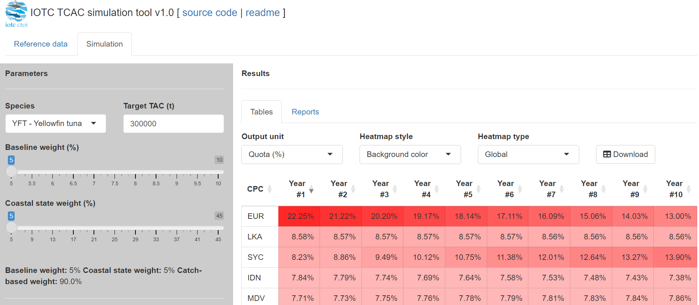

 

## Reference Data Panel

This panel provides access to three main categories of configuration datasets which are presented as sortable, filterable tables, and provide an interactive version of the tabular configuration files included with the application:

-   ***CPC summary***, with information on each IOTC entity (see fields of `CPC` worksheet described in the Section [Process Configuration](#configuration)

    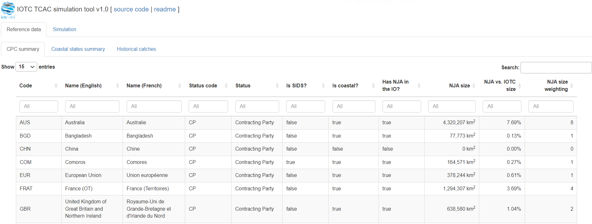

     

-   ***Coastal states summary***, with information on each Coastal State (see fields of  `COASTAL_STATE_SOCIO_ECONOMIC` worksheet described in Section [Process Configuration](#configuration))

    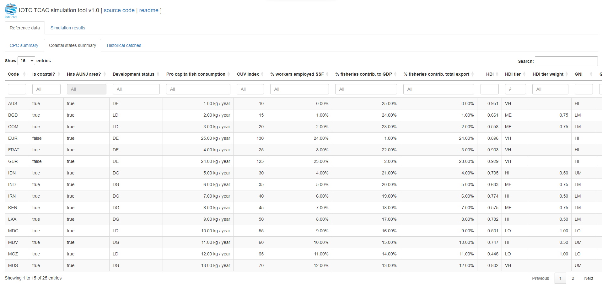

     

-   ***Historical catches***, with estimated catches for the five major IOTC species stratified by year, fleet, gear, school type, species, and assigned area (see fields described in the Section [Historical Catches](#historicalCatch))

    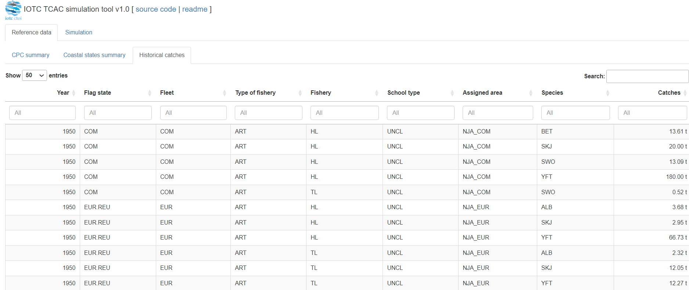

## Simulation Panel

This panel provides access to the configuration [parameters](#inputConfig) (left panel) and the simulation [results](#outputs) (right panel), projecting up to 10 years into the future to account for the transitional period in the allocation of catches from flag States to Coastal States, where applicable.

### Configuration Parameters

-   The ***Species*** subject to the simulation, which affects the catch records to be used to calculate the *catch-based* allocation component

-   The ***Target TAC*** in metric tonnes (t), which affects the estimated annual catches for each CPC and year

    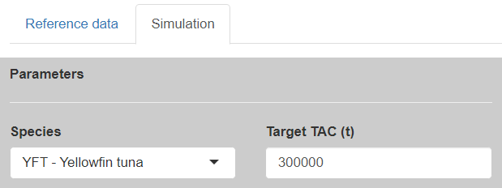

     

-   The main component weights

    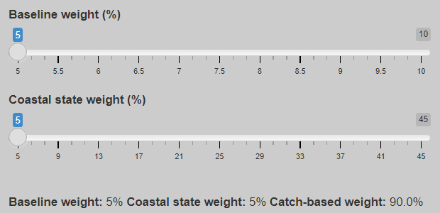

     

    1.  The ***Baseline weight*** does not require any additional configuration, as it assigns an equal portion of the quota to each CPC (see para. 6.5 of [IOTC-2024-TCAC13-REF02](https://iotc.org/documents/TCAC/13/REF02E))

        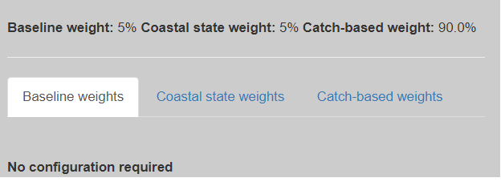

         

    2.  The ***Coastal state weight*** applies to all IOTC CPCs with a NJA in the IOTC Area of Competence (see para. 6.6(1) of [IOTC-2024-TCAC13-REF02](https://iotc.org/documents/TCAC/13/REF02E))

        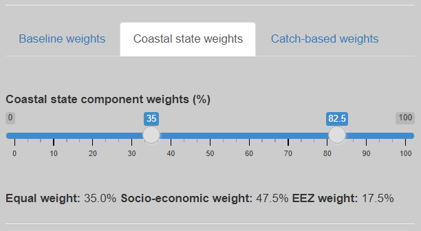

         

        This component weight is further broken down into:

        1.  ***Equal weight*** (see para. 6.6(1)(a) of [IOTC-2024-TCAC13-REF02](https://iotc.org/documents/TCAC/13/REF02E))

        2.  ***Socio-economic weight*** (see para. 6.6(1)(b) of [IOTC-2024-TCAC13-REF02](https://iotc.org/documents/TCAC/13/REF02E))

            Its sub-components can be selected from two possible options, which consider different aspects of the social and economic environment and status of all IOTC CPCs:

            -   **Option #1**: *Vulnerability + Priority sectors + Disproportionate burden* (see para. 6.6(1)(a)[OPTION 1] of [IOTC-2024-TCAC13-REF02](https://iotc.org/documents/TCAC/13/REF02E))

                 

                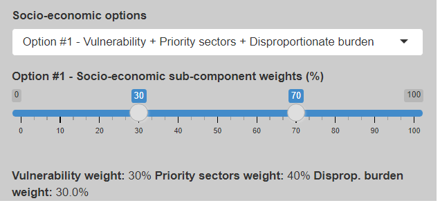

                 

                This option includes three distinct sub-component weights to account for:

                1.  the **Vulnerability** of the CPC (see para. 6.6(1)(a)[OPTION 1 (i)] [IOTC-2024-TCAC13-REF02](https://iotc.org/documents/TCAC/13/REF02E)), whose main components (equally weighted at 50% each) are:
                    -   the **Per capita fish consumption**
                    -   the **Commonwealth Universal Vulnerability index** (CUVI)
                2.  the **priority sectors** of the CPC (see para. 6.6(1)(a)[OPTION 1 (ii)] of [IOTC-2024-TCAC13-REF02](https://iotc.org/documents/TCAC/13/REF02E)), whose main components (equally weighted at 50% each) are:
                    -   the **Proportion of fish workers employed in small-scale and artisanal fisheries**
                    -   the **SIDS** status (yes / no)
                3.  the **Disproportionate burden** on developing CPCs (see para. 6.6(1)(a)[OPTION 1 (iii) of [IOTC-2024-TCAC13-REF02](https://iotc.org/documents/TCAC/13/REF02E)], whose main components (equally weighted at 50% each) are:
                    -   the **Contribution of the whole fisheries sector to the GDP**
                    -   the **Proportion of total export value made up of fisheries export**

                 

            -   **Option #2**: *HDI + GNI + SIDS* (see para. 6.6(1)(a)[OPTION 2] [IOTC-2024-TCAC13-REF02](https://iotc.org/documents/TCAC/13/REF02E))

                 

                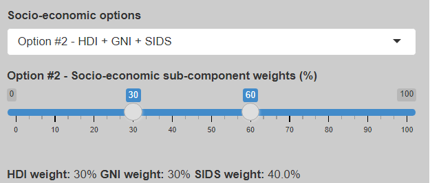

                 

                This option includes three distinct sub-component weights to account for:

                1.  The **Human Development Index** (HDI) status

                2.  The **Gross National Income** (GNI) status

                3.  The **Small Island Developing State** (SIDS) status

        3.  ***EEZ weight*** (see para. 6.6(1)(c) of [IOTC-2024-TCAC13-REF02](https://iotc.org/documents/TCAC/13/REF02E)) to replace the lack of indicators based on spatial stock abundance.

    3.  The ***Catch-based weight*** reflects the requirement that CPCs are eligible to receive allocations based on their historical catches for each stock. The criteria used to consider historical catches in determining this weight are outlined in para. 8 of [IOTC-2024-TCAC13-REF02](https://iotc.org/documents/TCAC/13/REF02E), and the simulation tool allows for selection and configuration of these criteria:

        1.  The ***Historical catch interval*** influences the calculation of average catches (see para. 6.8(1)(a) of [IOTC-2024-TCAC13-REF02](https://iotc.org/documents/TCAC/13/REF02E))

            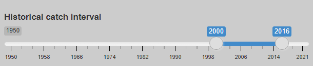

             

        2.  The type of ***Historical catch average*** to be considered (see para. 6.8(1)(a) of [IOTC-2024-TCAC13-REF02](https://iotc.org/documents/TCAC/13/REF02E)) must be selected from the following options:

            -   **Selected period** for calculating the average catch by CPC across the entire historical catch interval

                

                 

            -   **Best "n" years** for calculating the average catch by CPC over the top 'n' years (based on catches) identified within the historical catch interval, with ***Number of years*** as a selectable parameter

                

             

        3.  A stepwise approach (see paras. 6.8(2) and 6.12 of [IOTC-2024-TCAC13-REF02](https://iotc.org/documents/TCAC/13/REF02E)) is employed to implement the NJA attribution to coastal and flag states over a period of 6 or 10 years. This approach presents a species-independent set of 10 coefficients that determine the fraction of catches from a flag state estimated to have been taken into the NJA of a CPC, which shall therefore be assigned to the coastal state owning the NJA. Each coefficient represents the percentage of those catches to be attributed to the coastal state for that year. In theory, these coefficients should represent a progression from a starting value of less than 100% to 100% (indicating that all catches are attributed to the coastal state); however, nothing prevents users from introducing any sequence they prefer for these coefficients.

            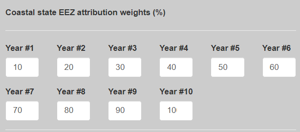{style="border: 1px solid black;"}

             

        4.  The ***High-seas only catches*** parameter of the simulation tool aims to facilitate the exploration of simulations for high seas-only catches, as the high seas are less affected by data limitations, do not require any assumptions on catch attribution (i.e., existence of fishing agreements), and exclude artisanal fisheries that occur solely within waters under national jurisdiction.

            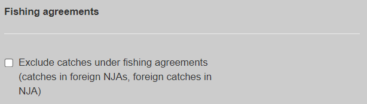

### Outputs

The outputs of the simulation are presented with two tabs: (i) Tables and (ii) Reports.

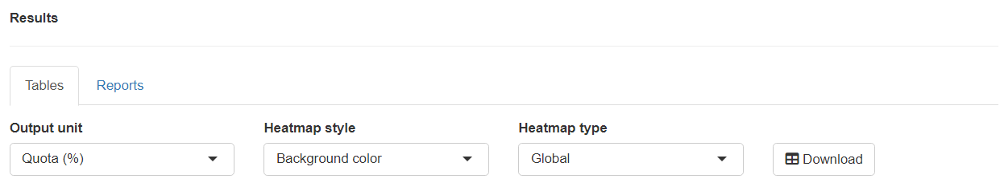

The tab **Tables** provides the final allocation table with CPCs as rows and allocation years as columns (from 1 to indicate the initial year, up to a maximum of 10). Each cell contains the quota assigned to the CPC for a specific year. Depending on the choice of the ***Output unit*** parameter, this quota can be expressed either as a fraction (% of the TAC for a given species) or as an absolute value in tonnes. The absolute value is computed from the output quotas (in %) and the TAC (in metric tonnes) set by the user.

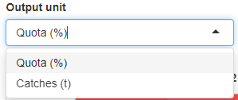

By default, each cell has a background colour whose intensity is directly proportional to the value within the cell, relative to other cells or values within the same year, or across the entire table.

The visual representation of the relative cell value can be changed via the ***Heatmap style*** parameter.

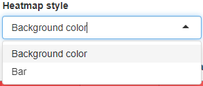

This presents two options:

-   **Background colour** (default) to represent the (relative) cell value through the intensity of the background

    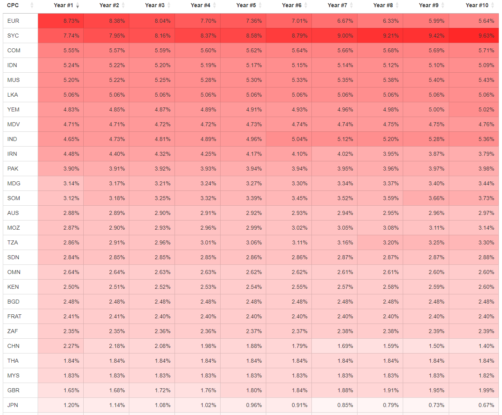

     

-   **Bar** to represent the (relative) cell value through a horizontal bar

    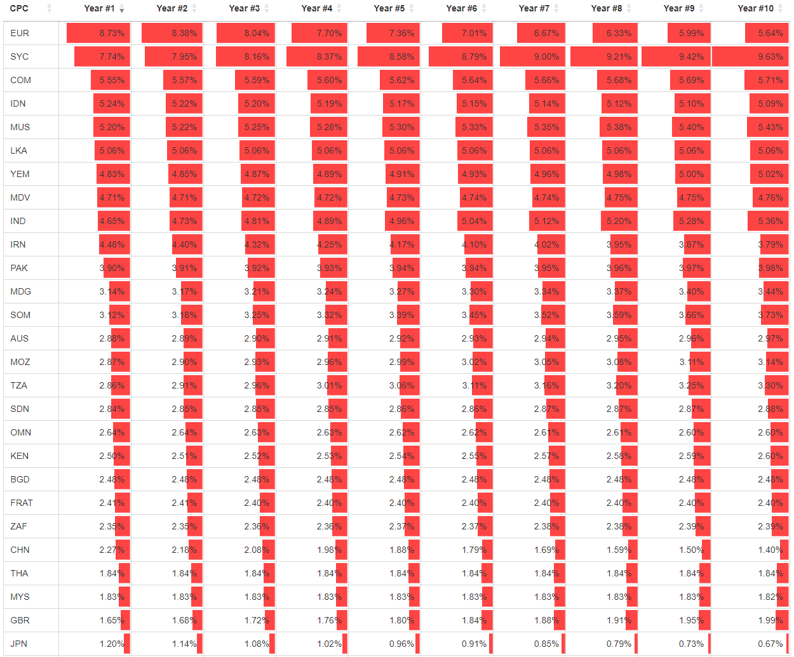

     

The context in which the relative cell value is calculated can also be modified using the ***Heatmap type*** parameter.

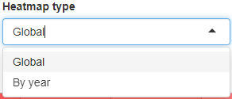

This presents two options:

-   **Global** (default), to calculate each cell's relative value with respect to all values in the table, or

-   **By year** to calculate each cell's relative value with respect to all values estimated for the same year

The simulation results can be downloaded as an Excel file through the ***Download*** button. The name of the file corresponds to the serialised date (including the time) at which the download request was issued (e.g., `TCAC13_simulation_2024_02_01_150856.xlsx`), while its content includes the following five worksheets:

1.  `CPC_REFERENCES` containing the CPC configuration parameters as in [`cfg/CPC_CONFIGURATIONS.xlsx`](./CPC_CONFIGURATIONS.xlsx)

2.  `COASTAL_STATE_REFERENCES` containing the coastal states configuration parameters as in [`cfg/CPC_CONFIGURATIONS.xlsx`](./CPC_CONFIGURATIONS.xlsx)

3.  `HISTORICAL_CATCHES` containing the historical catches for the selected species as extracted from [`cfg/HISTORICAL_CATCH_ESTIMATES.csv`](./HISTORICAL_CATCH_ESTIMATES.csv)

4.  `SIMULATION_CONFIGURATION` containing all the configuration parameters set by the users for the specific simulation round

5.  `OUTPUT_QUOTAS` containing the outputs of the simulation expressed either as fraction of the annual TAC or as catches in tons by CPC and simulation year (depending on the chosen value of the **output unit** parameter)

### Reports

The **Reports** tab provides access to reports that include the configuration parameters and output tables for all components (baseline, coastal State, and catch-based) and their sub-components. These reports downloadable either for all CPCs (Full report) or for a selected entity.

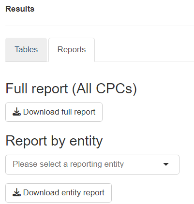

-->

