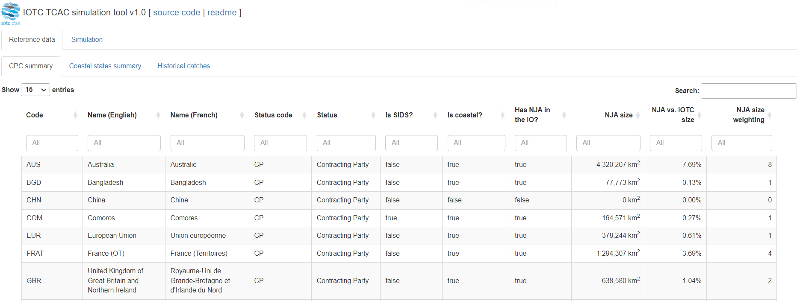
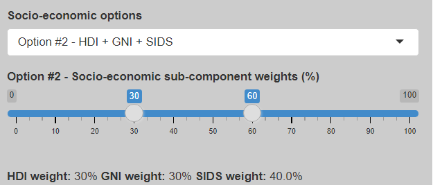
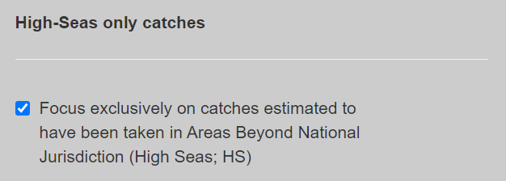

# Purpose

This document provides an overview of the [assumptions](#assumptions) and the final outputs produced by simulating the allocation criteria outlined in [IOTC-2024-TCAC13-REF02](https://iotc.org/documents/TCAC/13/REF02E). It also provides a description of the [*user interface*](#ui) of the simulation tool, with additional details on the various configuration parameters for both the [simulation process](#inputConfig) and the [generated outputs](#outputs).

# Process Configuration {#configuration}

The definitions of all relevant parameters characterising each CPC in relation to the allocation criteria are provided in the [`cfg/CPC_CONFIGURATIONS.xlsx`](./CPC_CONFIGURATIONS.xlsx) file which includes two worksheets:

-   A `CPC` worksheet that lists all current IOTC *Contracting Parties* (CP) as well as Liberia as *Cooperating Non-Contracting Party* (CNCP), and Taiwan,China as *Fishing entity* (FE), together with their:

    -   CODE: Mnemonic code (generally, the ISO3 code of the country)
    -   NAME_EN: Official English name
    -   NAME_FR: Official French name 
    -   STATUS_CODE: CP, CNCP, and FE
    -   STATUS: Contracting Party, Cooperating Non-Contracting Party, and Fishing Entity
    -   IS_SIDS: Small Island Developing States (SIDS) status
    -   IS_COASTAL: Coastal State status
    -   HAS_NJA_IO: Presence of a National Jurisdiction Area (NJA) within the [IOTC Area of Competence](https://iotc.org/about-iotc/competence)
    -   NJA_SIZE: Size of the NJA (km^2^)
    -   NJA_IOTC_RELATIVE_SIZE: Relative size of the NJA (percentage; %) with respect to the IOTC Area of Competence.
    

-   A `COASTAL_STATE_SOCIO_ECONOMIC` worksheet that lists all IOTC CPC Coastal States, along with their development status (sourced from [this document](https://www.un.org/development/desa/dpad/wp-content/uploads/sites/45/WESP2020_Annex.pdf)). It also includes a set of socio-economic indicators addressing the requirements of both *Option 1* and *Option 2* in [IOTC-2024-TCAC13-REF02](https://iotc.org/documents/TCAC/13/REF02E) para. 6.6(1)(b). It is important to note that the indicators required for *Option 1* are not yet available to the IOTC Secretariat. 

    -   CODE: Mnemonic code (generally, the ISO3 code of the country)
    -   NAME_EN: Official English name
    -   NAME_FR: Official French name
    -   DEVELOPMENT_STATUS: Least developed (LD), developing (DG), developed (DE)
    -   PER_CAPITA_FISH_CONSUMPTION_KG: Per capita fish consumption (kg / person / year) [*Option 1*]
    -   CUV_INDEX: Commonwealth Universal Vulnerability index [*Option 1*]
    -   PROP_WORKERS_EMPLOYED_SSF: Contribution (%) of fish workers employed in small-scale and artisanal fisheries [*Option 1*]
    -   PROP_FISHERIES_CONTRIBUTION_GDP: Contribution (%) of fisheries to GDP [*Option 1*]
    -   PROP_EXPORT_VALUE_FISHERY: Contribution (%) of fisheries exports to total export value [*Option 1*]
    -   HDI_STATUS: Human Development Index status [*Option 2*]
    -   GNI_STATUS: Gross National Income Status [*Option 2*]

The HDI and GNI indicators required for *Option 2* have been sourced from the [UNDP](https://hdr.undp.org/data-center/human-development-index#/indicies/HDI) and [World Bank](https://datahelpdesk.worldbank.org/knowledgebase/articles/906519-world-bank-country-and-lending-group) websites, respectively. The HDI for the EU was averaged using data from this [source](https://www.theglobaleconomy.com/rankings/human_development/European-union/). In absence of HDI data for Somalia, the lowest value in the dataset, 0.446 (reported for Mozambique), was used.

## Assumptions {#assumptions}

### CPC and Coastal State Configuration

The identification of a CPC as *being* or *not being* an IOTC Coastal State remains a subject of debate for some IOTC members with NJAs within the IOTC Area of Competence.

For the purposes of the simulations, the following assumptions were made:

-   The NJAs of the IOTC CPCs were sourced from the Flanders Marine Institute [*maritime boundaries* geodatabase](https://doi.org/10.14284/628). They are available for download from the [IOTC Data Reference Catalogue](https://data.iotc.org/reference/latest/domain/admin/shapefiles/IO_NJA_AREAS_1.0.0_SHP.zip).

-   The attribution of a NJA in the Indian Ocean to a given CPC reflects the information available to the IOTC as of 31/12/2023

-   For historical reasons, the waters of the Chagos Archipelago were considered to be under the sovereignty of the United Kingdom of Great Britain and Northern Ireland (`GBR`)

-   In addition to having an NJA in the Indian Ocean, France (OT) (`FRAT`) shall be considered de facto as an IOTC Coastal State (see Appendix 4, para. 2 of the [Report of the 12^th^ Technical Committee on Allocation Criteria](https://iotc.org/documents/TCAC/12/RE))

-   The European Union / REIO (`EUR`) has an NJA in the Indian Ocean (i.e., the NJA around Réunion and Mayotte) and, for this reason, "*should benefit from an allocation that relates to the size of the EEZ of its outermost territories in the IOTC Area of Competence.*" (see Appendix 4, para. 2 of the [Report of the 12^th^ Technical Committee on Allocation Criteria](https://iotc.org/documents/TCAC/12/RE))

-   Despite the above, `EUR` "(...) *would not be seeking the application of paragraph 6.6(1)(b) of the coastal state allocation criteria (...)*" (see Appendix 4, para. 2 of [Report of the 12^th^ Technical Committee on Allocation Criteria](https://iotc.org/documents/TCAC/12/RE))

-   There are different views as whether `EUR` "(...) *should benefit from the portion of the coastal state allocation criteria related to aspirations under paragraph 6.6(1)(a) (...)*" (see Appendix 4, para. 2 of the [Report of the 12^th^ Technical Committee on Allocation Criteria](https://iotc.org/documents/TCAC/12/RE)). In their current configurations, the simulations considered `EUR` as benefiting from the portion of allocation specified by paragraph 6.6(1)(a) of [IOTC-2024-TCAC13-REF02](https://iotc.org/documents/TCAC/13/REF02E)

-   Following TCAC12, in consultations between the IOTC Secretariat and the United Kingdom of Great Britain and Northern Ireland (`GBR`), `GBR` informed the Secretariat that para 6.6.(1)(b) would not apply to their case, but that paragraph 6.6.(1)(a) and (c) would. This understanding has been incorporated into the current configuration of the TCAC simulations conducted by the Secretariat.

### Historical Catches {#historicalCatch}

This information is essential for calculating the third component (*catch-based*) of the allocation criteria and can be downloaded from [`cfg/HISTORICAL_CATCH_ESTIMATES.csv`](./HISTORICAL_CATCH_ESTIMATES.csv). The file can be opened as a spreadsheet using MS Excel, LibreOffice Calc, Google Sheets, or any text editor.

The fields included in the catch dataset include:  

-   YEAR: Year of fishing
-   FLAG_CODE: Code for [flag States](https://data.iotc.org/reference/latest/domain/admin/#countries)
-   FLEET_CODE: Code for [fishing fleets](https://data.iotc.org/reference/latest/domain/admin/#fleets)
-   FISHERY_TYPE: code for main fishery categories (ART = Artisanal, IND = Industrial)
-   FISHERY_CODE: Code for [fishing gears](https://data.iotc.org/reference/latest/domain/fisheries/#Gears) 
-   SCHOOL_TYPE_CODE: Code for [types of tuna school association](https://data.iotc.org/reference/latest/domain/legacy/#schoolTypes) (LS = School associated with a drifting floating object, natural or artificial; FS = Free-swimming school)
-   ASSIGNED_AREA; Areas Beyond National Jurisdiction (HIGH_SEAS) or National Jurisdiction Areas (NJA) where the last three characters correspond to the [country](https://data.iotc.org/reference/latest/domain/admin/#countries) (e.g., NJA_COM = National Jurisdiction Area of Comoros)
-   SPECIES_CODE: ALB = albacore; BET = bigeye tuna; SKJ = skipjack tuna; SWO = swordfish; YFT = yellowfin tuna
-   CATCH_MT: estimated catch in metric tonnes.   

Historical catch data are available for all years from 1950 to 2021 stratified by year, fleet, gear, school type, species, and assigned area.

It is important to note that the need to apportion historical catches by flag or fleet according to the area of operation (high seas versus the NJA of any given coastal state) requires the IOTC Secretariat to estimate this information. This estimation process was presented at the last TCAC meeting in October 2023 and was agreed upon by the meeting participants (see [IOTC-2023-TCAC12-INF02](https://iotc.org/documents/TCAC/12/INF02)).

For this reason, the historical catch series with a full area breakdown is only available for the five major IOTC species (albacore, bigeye tuna, skipjack tuna, swordfish, and yellowfin tuna). These data have been estimated using the regular grid versus the NJA overlapping area fraction to assign catches estimated for the former to the area that falls within a given NJA.

[//]: # (> At this stage of the process, there is no additional information from CPCs to confirm whether their catches in a given grid should be attributed solely to the flag State. Therefore, the simulation uses the information in the `ASSIGNED_AREA` column of the historical catch series to calculate the annual catches for a given Coastal State or flag State (when required).)

To calculate the catch-based allocation weight for each CPC, information on historical catches is averaged across a selectable time frame using two possible approaches that require computation:

-   the annual average across the entire time period
-   the average of the best "*n*" years across the time period

In the latter case, the *best years* are defined as those with the highest catches during the selected period for a given fleet and species.

# User Interface {#ui}

The simulation is presented through an interactive R Shiny [web application](https://data.iotc.org/tcac13/simulations/) that is currently password-protected. Access credentials will be provided to participating delegates.

The main screen features two tabbed panels: one to display the [reference data](#referenceData) used by the simulation, and [another](#simulationResults) to present users with the [configuration parameters](#inputConfig) and the [simulation outputs](#outputs).

{style="padding-bottom: 1em;"}

 

## Reference Data Panel {#referenceData}

This panel provides access to three main categories of configuration datasets which are presented as sortable, filterable tables, and provide an interactive version of the tabular configuration files included with the application:

-   ***CPC summary***, with information on each IOTC entity (see fields of `CPC` worksheet described in the Section [Process Configuration](#configuration)

    

     

-   ***Coastal states summary***, with information on each Coastal State (see fields of  `COASTAL_STATE_SOCIO_ECONOMIC` worksheet described in Section [Process Configuration](#configuration))

    

     

-   ***Historical catches***, with estimated catches for the five major IOTC species stratified by year, fleet, gear, school type, species, and assigned area (see fields described in the Section [Historical Catches](#historicalCatch))

    {style="padding-bottom: 1em;"}

## Simulation Panel {#simulationResults}

This panel provides access to the configuration [parameters](#inputConfig) (left panel) and the simulation [results](#outputs) (right panel), projecting up to 10 years into the future to account for the transitional period in the allocation of catches from flag States to Coastal States, where applicable.

### Configuration Parameters {#inputConfig}

-   The ***Species*** subject to the simulation, which affects the catch records to be used to calculate the *catch-based* allocation component

-   The ***Target TAC*** in tonnes (t), which affects the estimated annual catches for each CPC and year

    {style="border: 1px solid black;"}

     

-   The main component weights sum up to 100% and have been restricted to 5-10% and 5-45% for the ***Baseline weight*** and the ***Coastal State Weight***, respectively, following [IOTC-2024-TCAC13-REF03_Rev1	](https://iotc.org/documents/TCAC/13/Ref03)

    {style="border: 1px solid black;"}

     

    1.  The ***Baseline weight*** does not require any additional configuration, as it assigns an equal portion of the quota to each CPC (see para. 6.5 of [IOTC-2024-TCAC13-REF02](https://iotc.org/documents/TCAC/13/REF02E))

        {style="border: 1px solid black;"}

         

    2.  The ***Coastal state weight*** applies to all IOTC CPCs with a NJA in the IOTC Area of Competence (see para. 6.6(1) of [IOTC-2024-TCAC13-REF02](https://iotc.org/documents/TCAC/13/REF02E))

        {style="border: 1px solid black;"}

         

        This component weight is further broken down into:

        1.  ***Equal weight*** (see para. 6.6(1)(a) of  [IOTC-2024-TCAC13-REF02](https://iotc.org/documents/TCAC/13/REF02E))

        2.  ***Socio-economic weight*** (see para. 6.6(1)(b) of  [IOTC-2024-TCAC13-REF02](https://iotc.org/documents/TCAC/13/REF02E))

            Its sub-components can be selected from two possible options, which consider different aspects of the social and economic environment and status of all IOTC CPCs:

            -   **Option #1**: *Vulnerability + Priority sectors + Disproportionate burden* (see para. 6.6(1)(a)[OPTION 1] of [IOTC-2024-TCAC13-REF02](https://iotc.org/documents/TCAC/13/REF02E))

                 

                {style="border: 1px solid black;"}

                 

                This option includes three distinct sub-component weights to account for:

                1.  the **Vulnerability** of the CPC (see para. 6.6(1)(a)[OPTION 1 (i)] [IOTC-2024-TCAC13-REF02](https://iotc.org/documents/TCAC/13/REF02E)), whose main components (equally weighted at 50% each) are:
                    -   the **Per capita fish consumption**
                    -   the **Commonwealth Universal Vulnerability index** (CUVI)
                2.  the **priority sectors** of the CPC (see para. 6.6(1)(a)[OPTION 1 (ii)] of [IOTC-2024-TCAC13-REF02](https://iotc.org/documents/TCAC/13/REF02E)), whose main components (equally weighted at 50% each) are:
                    -   the **Proportion of fish workers employed in small-scale and artisanal fisheries**
                    -   the **SIDS** status (yes / no)
                3.  the **Disproportionate burden** on developing CPCs (see para. 6.6(1)(a)[OPTION 1 (iii) of [IOTC-2024-TCAC13-REF02](https://iotc.org/documents/TCAC/13/REF02E)], whose main components (equally weighted at 50% each) are:
                    -   the **Contribution of the whole fisheries sector to the GDP**
                    -   the **Proportion of total export value made up of fisheries export**

                 

            -   **Option #2**: *HDI + GNI + SIDS* (see para. 6.6(1)(a)[OPTION 2] [IOTC-2024-TCAC13-REF02](https://iotc.org/documents/TCAC/13/REF02E))

                 

                {style="border: 1px solid black;"}

                 

                This option includes three distinct sub-component weights to account for:

                1.  The **Human Development Index** (HDI) status

                2.  The **Gross National Income** (GNI) status

                3.  The **Small Island Developing State** (SIDS) status

        3.  ***EEZ weight*** (see para. 6.6(1)(c) of [IOTC-2024-TCAC13-REF02](https://iotc.org/documents/TCAC/13/REF02E)) to replace the lack of indicators based on spatial stock abundance.

    3.  The ***Catch-based weight*** reflects the requirement that CPCs are eligible to receive allocations based on their historical catches for each stock. The criteria used to consider historical catches in determining this weight are outlined in para. 8 of [IOTC-2024-TCAC13-REF02](https://iotc.org/documents/TCAC/13/REF02E), and the simulation tool allows for selection and configuration of these criteria:

        1.  The ***Historical catch interval*** influences the calculation of average catches (see para. 6.8(1)(a) of [IOTC-2024-TCAC13-REF02](https://iotc.org/documents/TCAC/13/REF02E))

            {style="border: 1px solid black;"}

             

        2.  The type of ***Historical catch average*** to be considered (see para. 6.8(1)(a) of [IOTC-2024-TCAC13-REF02](https://iotc.org/documents/TCAC/13/REF02E)) must be selected from the following options:

            -   **Selected period** for calculating the average catch by CPC across the entire historical catch interval

                {style="border: 1px solid black;"}

                 

            -   **Best "n" years** for calculating the average catch by CPC over the top 'n' years (based on catches) identified within the historical catch interval, with ***Number of years*** as a selectable parameter

                {style="border: 1px solid black;"}

             

        3.  A stepwise approach (see paras. 6.8(2) and 6.12 of [IOTC-2024-TCAC13-REF02](https://iotc.org/documents/TCAC/13/REF02E)) is employed to implement the NJA attribution to coastal and flag states over a period of 6 or 10 years. This approach presents a species-independent set of 10 coefficients that determine the fraction of catches from a flag state estimated to have been taken into the NJA of a CPC, which shall therefore be assigned to the coastal state owning the NJA. Each coefficient represents the percentage of those catches to be attributed to the coastal state for that year. In theory, these coefficients should represent a progression from a starting value of less than 100% to 100% (indicating that all catches are attributed to the coastal state); however, nothing prevents users from introducing any sequence they prefer for these coefficients.

            {style="border: 1px solid black;"}

             

        4.  The ***High-seas only catches*** parameter of the simulation tool aims to facilitate the exploration of simulations for high seas-only catches, as the high seas are less affected by data limitations, do not require any assumptions on catch attribution (i.e., existence of fishing agreements), and exclude artisanal fisheries that occur solely within waters under national jurisdiction.

            {style="border: 1px solid black;"}

### Outputs {#outputs}

The outputs of the simulation are presented with two tabs: (i) Tables and (ii) Reports.

The tab **Tables** provides the final allocation table with CPCs as rows and allocation years as columns (from 1 to indicate the initial year, up to a maximum of 10). Each cell contains the quota assigned to the CPC for a specific year. Depending on the choice of the ***Output unit*** parameter, this quota can be expressed either as a fraction (% of the TAC for a given species) or as an absolute value in tonnes. The absolute value is computed from the output quotas (in %) and the TAC (in tonnes) set by the user.

By default, each cell has a background colour whose intensity is directly proportional to the value within the cell, relative to other cells or values within the same year, or across the entire table.

The visual representation of the relative cell value can be changed via the ***Heatmap style*** parameter.

This presents two options:

-   **Background colour** (default) to represent the (relative) cell value through the intensity of the background

    {style="padding-bottom: 1em;"}

     

-   **Bar** to represent the (relative) cell value through a horizontal bar

    {style="padding-bottom: 1em;"}

     

The context in which the relative cell value is calculated can also be modified using the ***Heatmap type*** parameter.

This presents two options:

-   **Global** (default), to calculate each cell's relative value with respect to all values in the table, or

-   **By year** to calculate each cell's relative value with respect to all values estimated for the same year

The simulation results can be downloaded as an Excel file through the ***Download*** button. The name of the file corresponds to the serialised date (including the time) at which the download request was issued (e.g., `TCAC13_simulation_2024_02_01_150856.xlsx`), while its content includes the following five worksheets:

1.  `CPC_REFERENCES` containing the CPC configuration parameters as in [`cfg/CPC_CONFIGURATIONS.xlsx`](./CPC_CONFIGURATIONS.xlsx)

2.  `COASTAL_STATE_REFERENCES` containing the coastal states configuration parameters as in [`cfg/CPC_CONFIGURATIONS.xlsx`](./CPC_CONFIGURATIONS.xlsx)

3.  `HISTORICAL_CATCHES` containing the historical catches for the selected species as extracted from [`cfg/HISTORICAL_CATCH_ESTIMATES.csv`](./HISTORICAL_CATCH_ESTIMATES.csv)

4.  `SIMULATION_CONFIGURATION` containing all the configuration parameters set by the users for the specific simulation round

5.  `OUTPUT_QUOTAS` containing the outputs of the simulation expressed either as fraction of the annual TAC or as catches in tons by CPC and simulation year (depending on the chosen value of the **output unit** parameter)

### Reports {#reports}

The **Reports** tab provides access to reports that include the configuration parameters and output tables for all components (baseline, coastal State, and catch-based) and their sub-components. These reports downloadable either for all CPCs (Full report) or for a selected entity.

