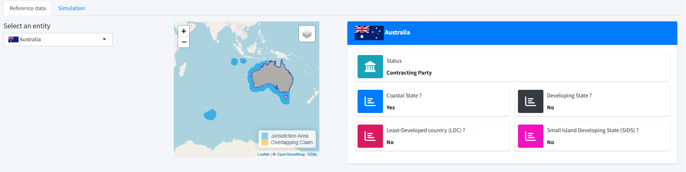
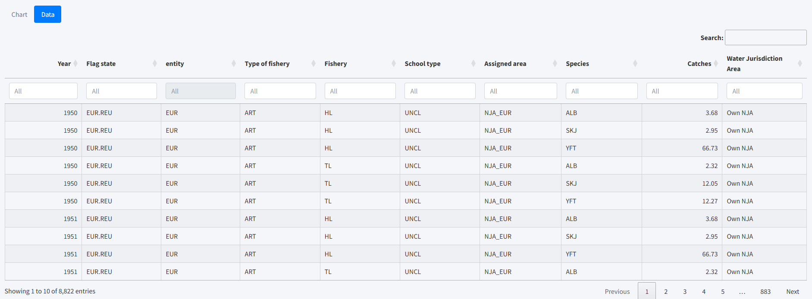
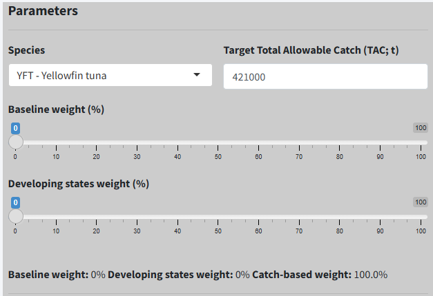
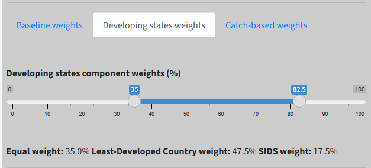
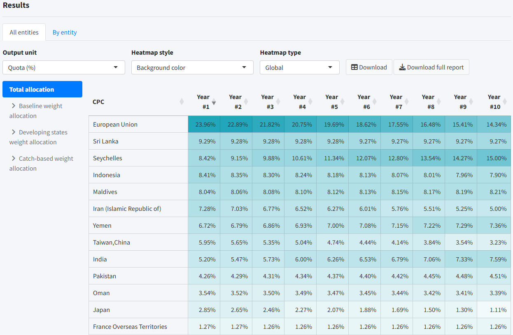
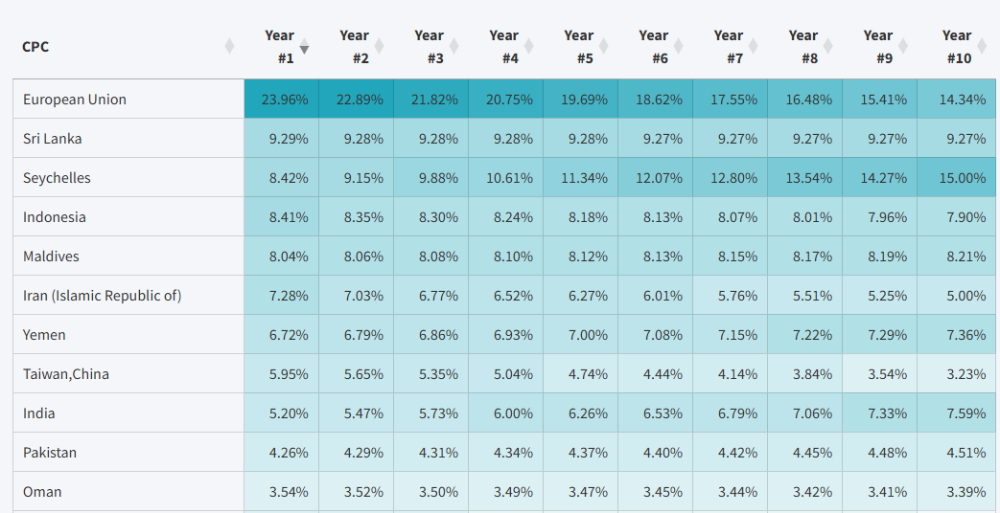
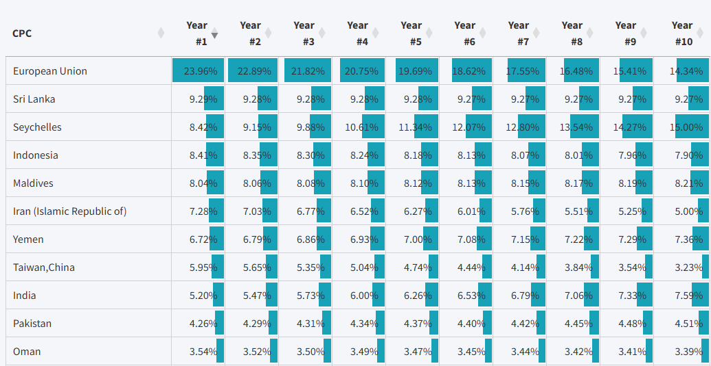
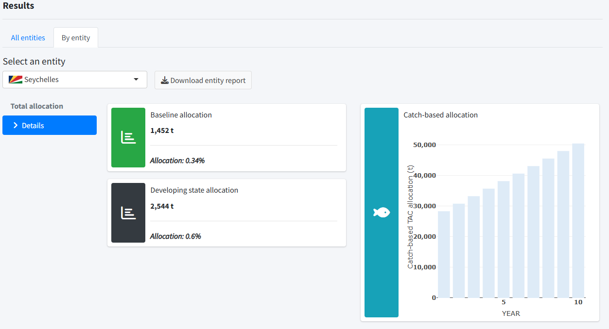

The simulations are presented through an interactive R Shiny [web application](https://foodandagricultureorganization.shinyapps.io/iotc-tcac-simulations-review/). Access to the application is password-protected.

The main interface consists of two tabbed panels:

1. [Reference data](#referenceData) – provides access to, and allows exploration of, the input datasets used in the simulations.
2. [Parameters](#parameters) – allows users to view and modify the configuration parameters and to visualise the simulation results.
 
## Reference Data Panel {#referenceDataPanel}

This panel is divided into two horizontal components.

### Top Panel

The top panel allows the user to select the IOTC entity of interest from a drop-down list. Once an entity is selected, its National Jurisdiction Area (NJA) (see [ReadMe file](./README.html)) is displayed on an interactive map.

Key characteristics of the selected entity are also summarised in an information frame, including:

-   the entity status (Contracting Party or Fishing Entity);
-   whether the entity is a coastal State;
-   whether it is classified as a developing State;
-   whether it is a least-developed country; and
-   whether it is a Small Island Developing State (SIDS).

 

### Bottom Panel

The bottom panel is composed of two tabs: 

- **Chart**

This tab allows the user to select the species of interest from a drop-down list. Five species are currently considered for allocation: albacore, bigeye tuna, skipjack tuna, swordfish, and yellowfin tuna.

The estimated catch time series for the selected entity and species are displayed as an interactive stacked bar chart, disaggregated by the spatial origin of the catch:

- Own NJA (green) – catch taken within the entity’s national jurisdiction waters by all national fisheries;

- High seas (blue) – catch taken on the high seas by national surface and longline fisheries; and

- Foreign NJAs (red) – catch taken by national surface and longline fisheries within the national jurisdiction areas of other entities.

 

- **Data**

This tab allows the user to view all catch data used as inputs to the simulations in an interactive table. The table includes search and filtering options, enabling users to quickly locate and explore specific records.

 

## Simulation Panel {#simulationPanel}

This panel provides access to the simulation configuration [parameters](#parameters) (left panel) and the simulation [results](#results) (right panel). The simulations project up to 10 years into the future in order to account for the transitional period associated with the allocation of catches from flag States to coastal States, where applicable.

### Parameters {#parameters}

This panel allows the user to select the **species** subject to the simulation from a drop-down list and to specify the **Target Total Allowable Catch (TAC)**, expressed in metric tonnes (t). Default TAC values are provided for each species and may be updated manually by the user. The selected TAC values are used in the simulations to express the quotas allocated to each entity in terms of the amount of catch allocated.

{style="display:block; margin-left:auto; margin-right:auto;"}

 

Once the species and TAC are set, the panel allows the user to define the values of the three allocation component weights, whose sum must equal 100%:

1. **Baseline weight**

Assigns an equal portion of the TAC to all Contracting Parties.

2. **Developing States weight**

Applies to IOTC coastal developing States. This weight is further divided into three sub-components:

- **Equal weight** -- portion of the TAC allocated evenly among the 21 IOTC developing coastal States

- **Least-Developed Country (LDC) weight** -- portion of the TAC allocated evenly among the 8 IOTC least-developed coastal States

- **Small Island Developing States (SIDS) weight** -- portion of the TAC allocated evenly among the 4 IOTC SIDS.

{style="display:block; margin-left:auto; margin-right:auto;"}

 

3. **Catch-based weight**

Allocates the TAC to each Contracting Party and Taiwan,China, in proportion to its historical contribution to the total catch of the selected species.

The user can select one of two reference periods within the historical catch interval to calculate average historical catches:

- **Selected period** -- a continuous range of years

- **Best "n" years** -- the top 'n' years with the highest catches within the historical interval, with Number of years as a selectable parameter.

{style="display:block; margin-left:auto; margin-right:auto;"}

 

In a final step, the reallocation of catches taken by foreign fleets within a coastal state's NJA is implemented gradually over a transitional period of 6 or 10 years. For each year, a coefficient specifies the fraction of these catches to be attributed to the coastal state. By default, the coefficients increase from less than 100% to 100% over the period, so that all catches are eventually assigned to the coastal state. Users can modify the sequence of coefficients if desired.

### Results {#results}

The results of the simulation are presented in two tabs: **All entities** and **By entity**.

#### All Entities

This tab displays the final allocation table, with CPCs as rows and allocation years as columns (1 to 10). Each cell shows the quota assigned to a CPC for a given year.

The quota can be expressed as either:

- Percentage of the TAC (default), or

- Absolute value in tonnes, calculated from the percentage and the TAC set by the user.

{style="display:block; margin-left:auto; margin-right:auto;"}

 

By default, cell background colour intensity reflects the relative value of the quota. The appearance can be adjusted using the Heatmap style parameter:

- Background colour (default) -– cell intensity represents relative value

{style="display:block; margin-left:auto; margin-right:auto;"}

 

- Bar -– relative value is shown with a horizontal bar inside each cell

{style="display:block; margin-left:auto; margin-right:auto;"}

 

The Heatmap type parameter determines the context for relative values:

- **Global (default)** – compares all values in the table.

- **By year** – compares values within the same year only.

- Downloading Results

The simulation results can be downloaded as an Excel file through the ***Download*** button. The name of the file corresponds to the serialised date (including the time) at which the download request was issued (e.g., `TCAC_simulation_2026_01_25_121303.xlsx`), while its content includes the following five worksheets:

1.  `CPC_REFERENCES` containing the CPC configuration parameters as in [`inputs/data/iotc_entities.csv`](./inputs/data/iotc_entities.csv)

2.  `HISTORICAL_CATCHES` containing the historical catches for the selected species as extracted from [`inputs/data/HISTORICAL_CATCH_ESTIMATES.csv`](./inputs/data/HISTORICAL_CATCH_ESTIMATES.csv)

3.  `SIMULATION_CONFIGURATION` containing all the configuration parameters set by the users for the specific simulation round

4.  `OUTPUT_QUOTAS` containing the outputs of the simulation expressed either as fraction of the annual TAC or as catches in tonnes by CPC and simulation year (depending on the chosen value of the **output unit** parameter)

The **Reports** tab provides access to reports that include the configuration parameters and output tables for all components (baseline, coastal State, and catch-based) and their sub-components. These reports downloadable either for all CPCs (Full report) or for a selected entity.

#### by Entity

{style="display:block; margin-left:auto; margin-right:auto;"}
